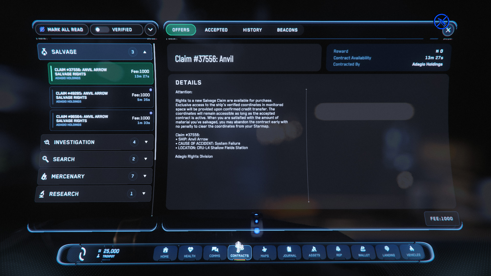

{{version_check("3.24.2")}}

## Info

Any ship - player, NPC or otherwise - is a valid target for salvaging. It's
possible to find shipwrecks to loot & salvage by simply flying around the
'verse until something shows up, but there are also some reliable methods to
find valid salvage opportunities.

## Salvage Missions

The most predictable and reliable method is to select a Salvage mission from the
Contract manager.

1. Open your Mobiglass (++f1++), select the Contract Manager then expand the
Salvage list

    {width=600}

    > ***Note:*** There are also Salvage missions available under the Unverified
    tab; these will have higher rewards or lower fees, but come with additional
    risk and may cause you to gain a CrimeStat.

2. You will need to have enough aUEC in your account to cover the contract fee,
as you are paying for the location of and exclusive rights to a salvagable
wreck.

3. Click different contracts to see more details; consider the location of the
claim (for travel time) and the type of ship - e.g. you might choose a military
ship to loot the weapons, or a bulk hauler to get a better chance of valuable
cargo.

    <!-- markdownlint-disable-next-line MD013 -->
    !!! tip "Initially you will only have access to 3-4 claims, and for small ships - completing salvage missions will unlock more & larger claims."

4. Click the "Fee: *xxx*" button to pay the claim fee and receive the ship
location.

## Make your own

Any destroyed or disabled ship is valid salvage; this includes the wrecks of
other players' ships, or NPCs from Bounty missions and combat Service Beacons.

If you're looking for sub-capitals to salvage, complete ERT bounties or Critical
Service Beacons; or negotiate with other players to get the location of bounties
they've destroyed.
