{{version_check("3.24.2")}}

## Info

One of the simplest missions in Star Citizen is a Delivery - collect one or
more packages from a nearby outpost or station, and deliver them to another
location. These missions don't pay a lot, but they don't require any fees, setup
or specific equipment and are a great way to explore the 'verse.

!!! info "Suitable Ships"
    Delivery packages are a physical object that you will need to transport
    around the 'verse, and so you will need a ship that has an interior or
    cargo space that can hold them. Dedicated fighters may not be suitable,
    though some will have an openable compartment that is not immediately
    obvious (e.g. the Mustang Alpha).

### Delivery Companies

Each planetary system in Stanton is served by a different delivery company, and
you will need to complete an evaluation mission with each of them before they
offer you a full selection of delivery missions. As you build more reputation
with a given company, they may offer you larger or more risky missions.

If you fail several delivery missions with the same company, you will lose
reputation and they may stop offering you work.

### Retrieval Ops

You will also see Retrieval Ops available under the Delivery contracts section -
these are a riskier version of delivery missions in which you must first extract
the package from a derelict outpost or settlement, where you may encounter
hostile NPCs. There are offered by the same company wherever you are in Stanton
\- Northrock Service Group - and reputation is handled separately from other
delivery missions.

The steps for completing a Retrieval Op are much the same as for Delivery
missions, though be sure to take armour and a weapon - and don't stick around
too long, as a hostile Cutlass may show up and drop off reinforcements, or
attack your ship!

## Delivery Mission

1. Open your Mobiglass (++f1++) and the Contracts app, select Delivery and
accept a delivery mission or evaluation.

    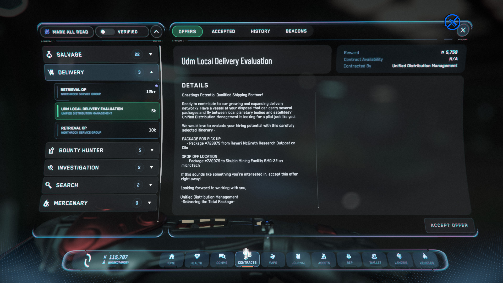{ width=600 }

    Note that the contract will include information about the number of packages
    and where they are going from & to.

    ??? tip "Multiple Packages"
        As with all contracts in Star Citizen, Delivery missions can be impacted
        by bugs and glitches which cause them to fail or get stuck. Though you
        may be offered contracts for multiple packages in one delivery, it is
        recommended to avoid contracts involving more than 2 or 3, as these have
        a much higher chance to fail and you won't receive payment for a partial
        completion.

        Shipping a large number of packages at once also tends to pay worse, so
        you're better off taking multiple, smaller contracts.

1. Travel to the pick-up point for the package. There will be a mission marker
on your map showing the pick-up location, and the name of the location will be
listed in the Accepted contract screen.

    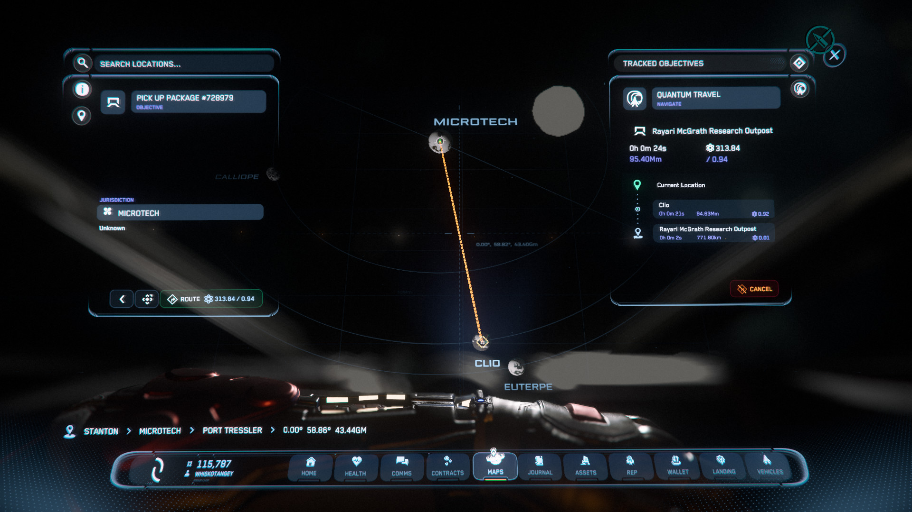{ width=600 }

1. Land at the pick-up location and follow the HUD marker to the specific
building. At ground stations, you'll typically collect packages from the Storage
building marked with a spire with yellow lights.

    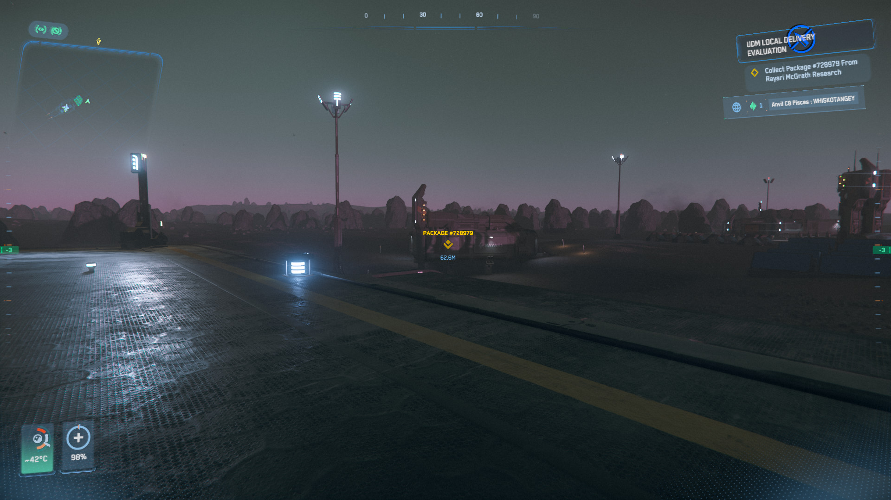{ width=600 }

1. Inside, you'll find the package either stacked on a shelf or stored in a
kiosk.

    To collect from the shelf, simply walk up and tap ++f++ to Carry.

    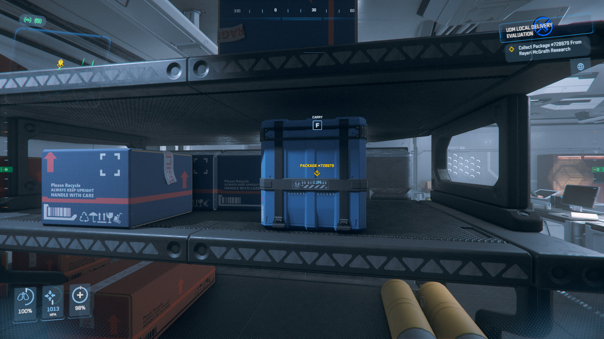{ width=600 }

    To collect from the kiosk, walk up, hold ++f++ and click Pick Up (shown with
    a down arrow) on the screen, then wait for the kiosk to open. Quickly face
    the package and tap ++f++ to Carry, before the kiosk door closes again.

    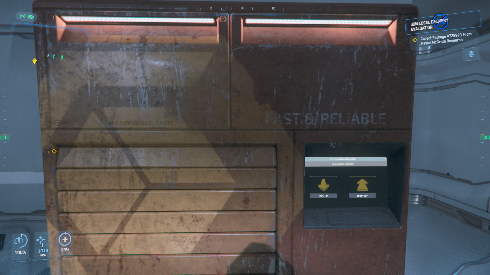{ width=600 }

1. Take the package back to your ship and stow it. You can hold ++f++, look down
at the package in your hands, then right-click to see options for putting it
down. Drop will simply drop it at your feet, while Place will let you stow it
neatly; position the blue highlighted hologram where you want the box to go,
then click again to place.

    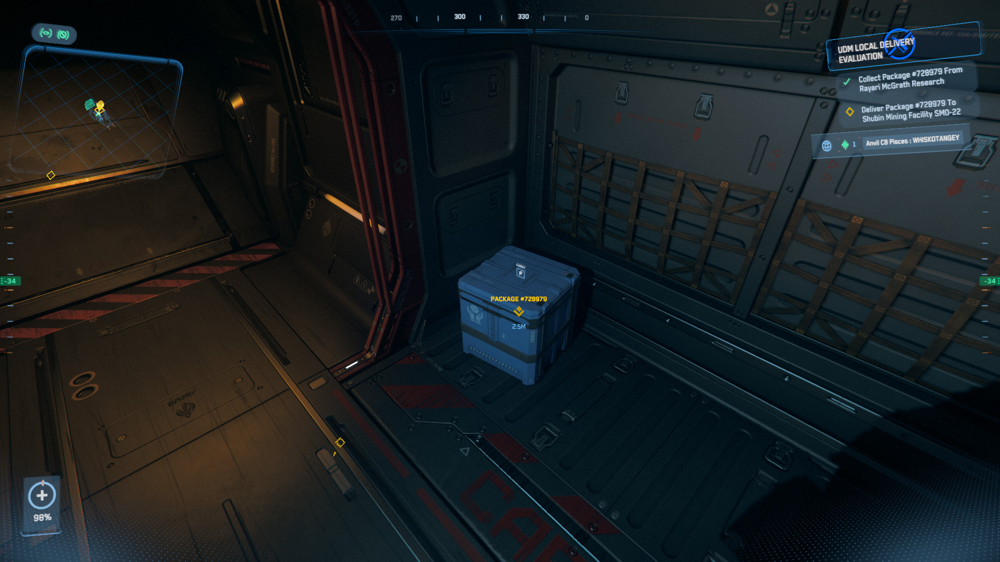{ width=600 }

1. If you have a [tractor beam](../../fps/equipment/tractor-beam.md) equipped,
you can use that to move the package around in your ship. Unfortunately, pick-up
& drop-off locations are typically in armistice so you'll only be able to use
the beam while on the landing pad.

    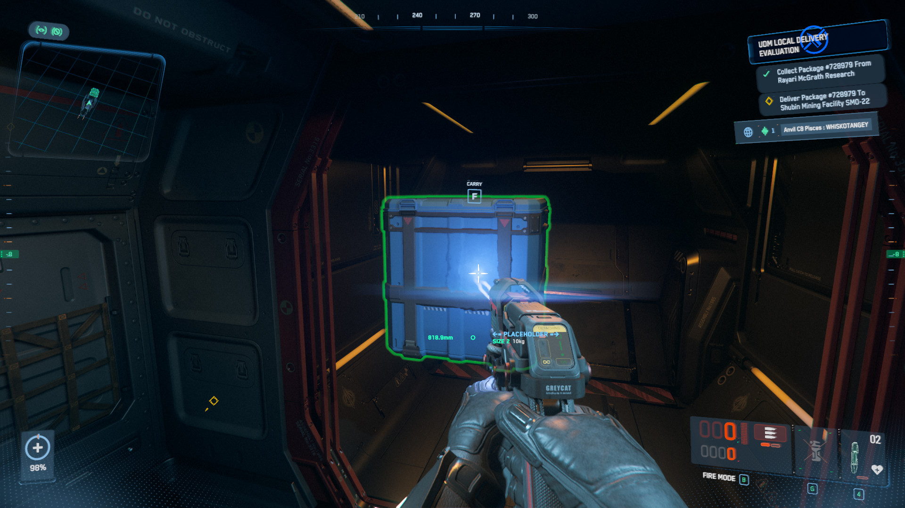{ width=600 }

1. Fly to the drop-off location; you'll have a marker on your map again, and on
your HUD.

    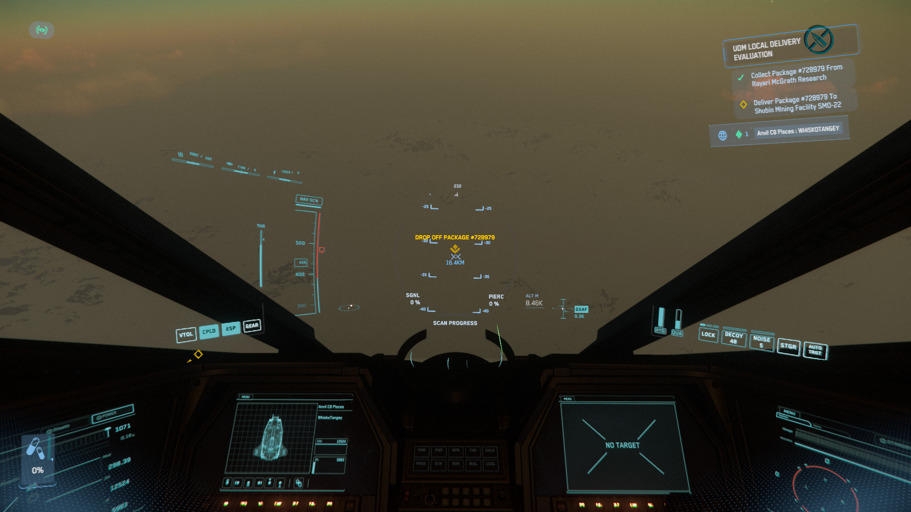{ width=600 }

1. Follow the HUD marker to the specific drop-off building; again, the drop-off
may be to a kiosk or an empty spot of a shelf.

    Some drop-offs may be to unusual locations like the top of city skyscrapers
    or inside space stations. At a station, head to the Galleria deck and find
    the Admin office.

    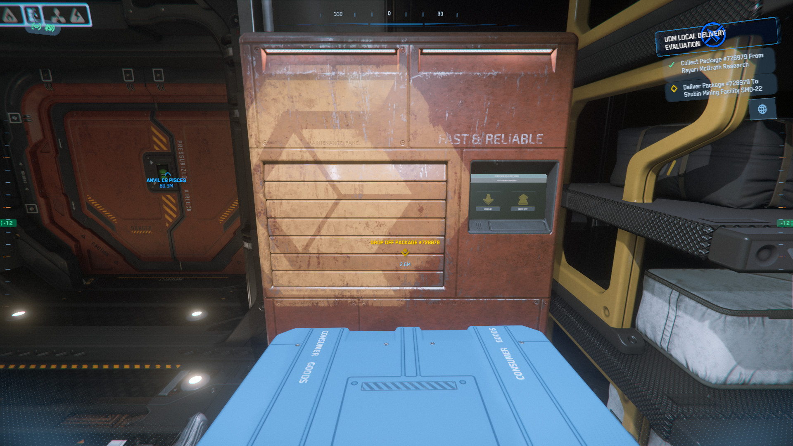{ width=600 }

1. Place the package on the shelf, or click Drop Off on the kiosk screen then
Place in the open slot. Look at the empty space/slot until the Place prompt
appears then tap ++f++ (don't use the Drop/Place interactions on the package
itself).

    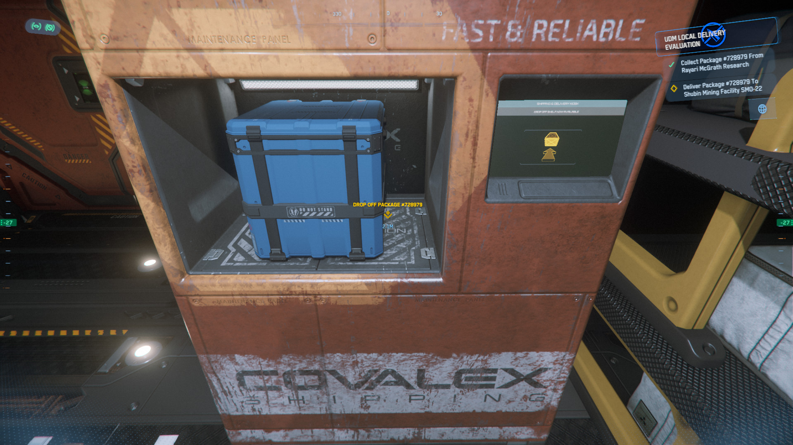{ width=600 }

1. The mission is now complete.

    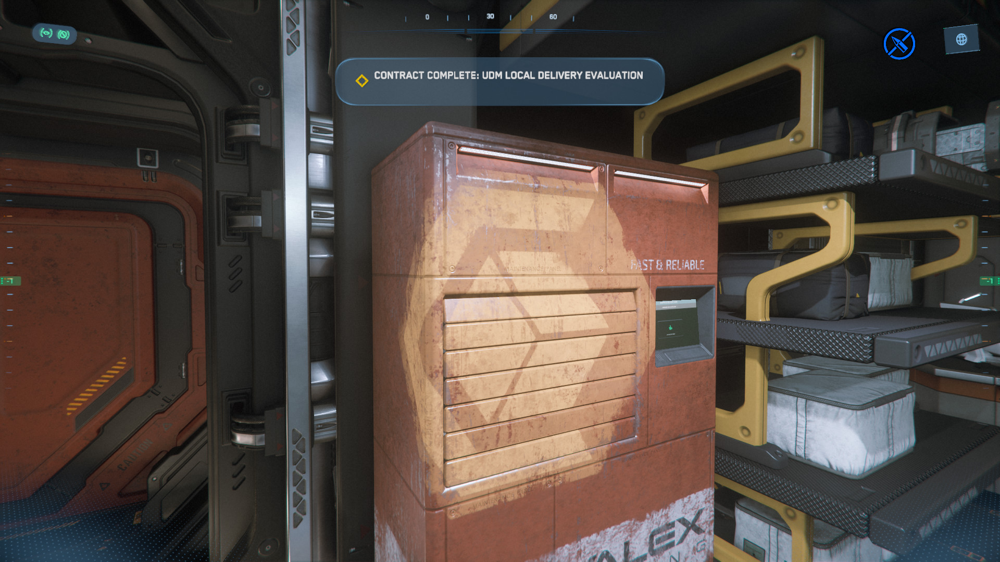{ width=600 }
