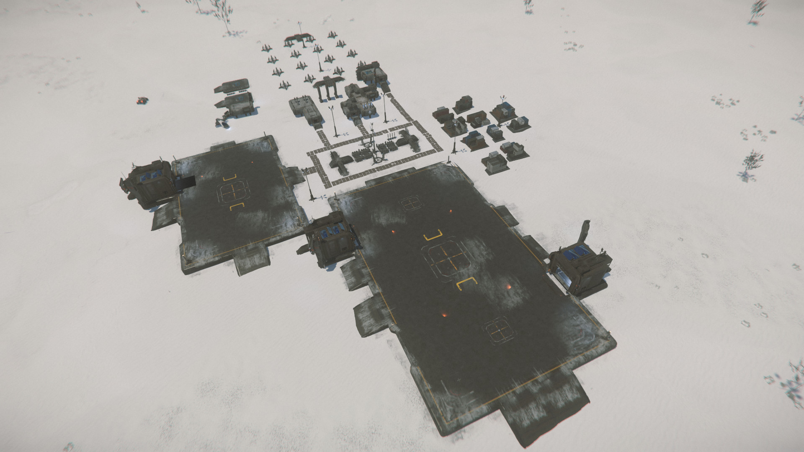
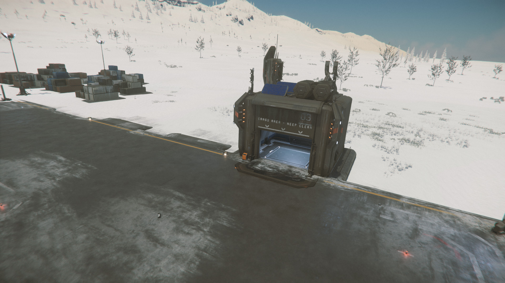
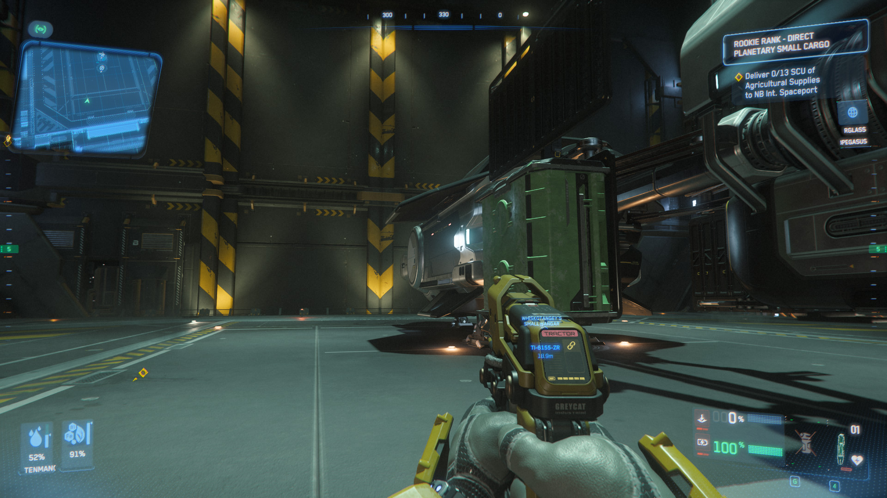

{{version_check("4.1")}}

## Info

Hauling missions are a simple & safe introduction to the industrial cargo
profession, and they can pay very well - especially if you stack multiple
contracts on a single route. The mission is simple - collect cargo crates from
one location, stow them in your ship, and deliver them to another location. As
you're transporting someone else's cargo, there's no up-front investment, but
the cargo is also marked as "contracted" so you can't take it to a trade console
and sell it yourself - at least, not any legal ones.

!!! info "Requirements"
    ### Ship
    You'll need a ship capable of carrying the cargo; starter ships typically
    carry 3-4 SCU (Standard Cargo Units), while the entry-level hauling missions
    will require you to carry 7-10 SCU. You can see the cargo capacity of your
    ship at the ASOP ship terminals:

    

    While you can make multiple trips for a single hauling mission, it's usually
    better to find a larger ship and make the haul in a single trip. All cities
    have [rental locations](../../ships/rent-ships.md) where you can pick up a
    dedicated cargo hauler for less than the payout of a single hauling mission.

    ### Tractor Beam

    The cargo containers are too large to be carried by hand, and you'll need a
    [tractor beam](../../fps/equipment/tractor-beam.md) to lift, carry and stow
    them. Some ships will have a vehicle tractor beam equipped, especially if
    they're a dedicated cargo hauler, or you can use an ATLS cargo mech to move
    crates - but in general, you should have a tractor beam handy so you're
    always able to move cargo around when necessary.

!!! warning
    As you take higher-level hauling missions, the size of the individual crates
    will also get larger - they start at 1 SCU but can be as large as 32 SCU! Be
    sure that the ship you're using also has space for the size of cargo crate
    you're hauling.

## Hauling Contract

1. Open your Mobiglass (++f1++) and the Contracts app, select Hauling and
accept a hauling mission or evaluation.

    

    You will initially only see one contract available, but as you complete
    contracts and earn more reputation with Covalex, higher-level missions with
    bigger payouts and larger payloads will become available.

    > ***Note:*** When selecting a mission, try to avoid contracts that have
    > ground stations (Rayari, Shubin Mining, HDMS etc) as a pick-up or drop-off
    > point; these are more prone to bugs and issues than other locations, like
    > distribution centres, cities or space stations.

1. Collect your ship, travel to the pick-up location and locate a freight
elevator. At cities & space stations, these are inside your hangar:

    

    At distribution centres, they are attached to the landing pads on either
    side wing of the main building, or inside the hangars:

    
    

    At ground stations, they are attached to the open landing pads:

    
    

1. Access the terminal.

    
    

1. Send the elevator down.

    
    

1. Find the cargo containers listed in the warehouse (the right). Your personal
inventory will also show here, so you may have to scroll down to find the
mission containers.

    

    > ***Note:*** Containers will be grouped by size and contents - so if you
    > have 8 x 1 SCU containers of Carbon to pick up, you'll see a single image
    > in the Warehouse, but it'll be marked 'x8'

1. Drag each container onto the elevator on the left and raise it.
    
    
    

1. Your cargo will be visible on the raised elevator for you to collect and
load.
    

1. Using your tractor beam (++5++), left-click to detach the cargo from the
elevator and carry it to your ship's cargo grid.
    
    

    > ***Note:*** The cargo grid is in a different area of each ship.

    - For Auroras, it is a short rail underneath the main hull at the aft.
    - For the Mustang Alpha, it is in a lowerable cargo pod that is accessed
      by a button at the aft of the hull.
    - For most small/medium ships (e.g. the Avenger Titan, Cutter, Pisces,
      Cutlass Black or Freelancer), the cargo grid is in the interior hold and
      is accessed by opening the rear ramp.
    - For a small number of haulers like the Nomad or Hull-A, the cargo grid
      is on the outside of the ship but must be lowered with a button or opened
      with ++alt+k++ from the pilot seat.

1. A blue hologram will show when the cargo is ready to snap to the grid.
Left-click again to attach the cargo to the grid.
    
    

1. Load all the cargo onto your ship. If you are unable to take all of the cargo
in a single trip, be sure to send any remaining cargo back down the freight
elevator so that it is not lost.
    

1. Travel to the destination.
    

1. Find the freight elevator as before, and unload the cargo from your ship
grid. If the elevator has already been sent down, use the terminal to raise it.
Note that the cargo *must* be snapped to the elevator cargo grid - loose objects
will stop the elevator from being lowered.
    

1. Access the elevator terminal. Any cargo or items you have snapped to the
elevator grid will show on the left.
    

1. Send the elevator down - you will see a confirmation screen showing the
cargo you are submitting, and if any is missing. Click Confirm to submit the
cargo and complete the mission.
    

1. Mission complete!
    