{{version_check("3.24.3")}}

## Info

A simple mission for new players, research missions involve collecting a
scientific probe from station admins and deploying it in orbit of a moon or
planet. They pay a small amount but can be completed quickly and don't require
specialist equipment; they do involve EVA though so you'll want an airtight
flightsuit or armour.

!!! info "Suitable Ships"
    Probes are a physical object that you will need to transport around the
    'verse, and so you will need a ship that has an interior or cargo space that
    can hold them. Dedicated fighters may not be suitable, though some will have
    an openable compartment that is not immediately obvious (e.g. the Mustang
    Alpha).

## Research Mission

1. Open your Mobiglass (++f1++) and the Contracts app, select Research and
accept a Collect and Deploy Probe contract.

1. Travel to the pick-up point for the probe. There will be a marker in your
starmap (++f2++) for the location, though you may not be able to set a route to
it - instead, set a route to the station listed in the contract.

    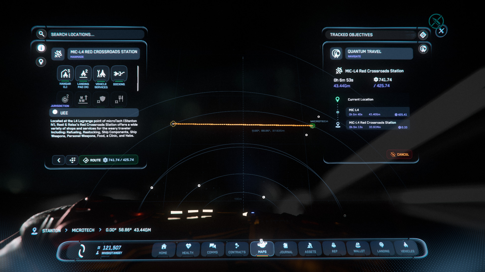{ width=600px }

1. Land at the pickup station, find the Internal Transit elevator and travel to
the Galleria.

    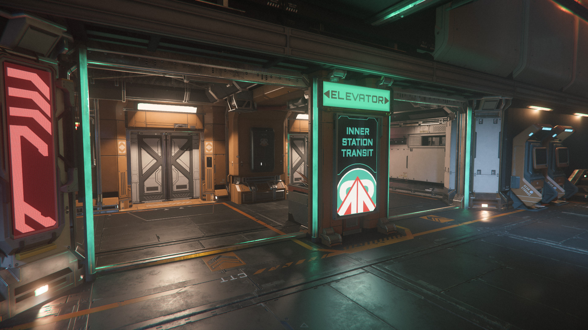{ width=300px }
    { width=300px }

1. Find the Admin office and collect the probe from the package terminal there.

    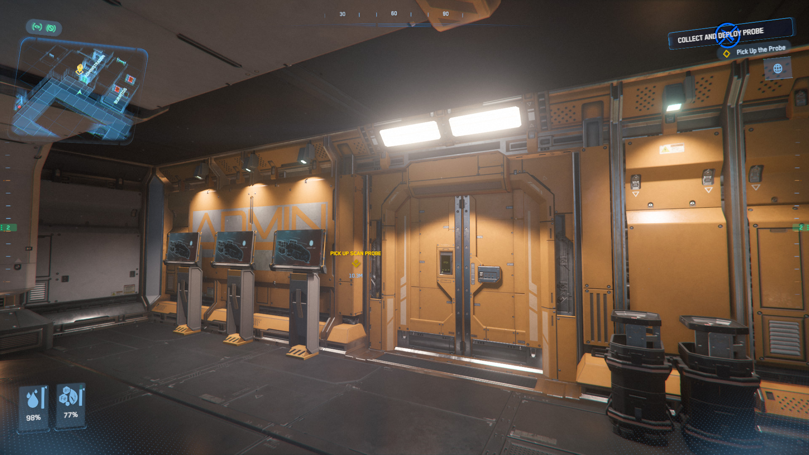{ width=600px }

    To collect from the terminal, walk up, hold ++f++ and click Pick Up (shown
    with a down arrow) on the screen, then wait for the kiosk to open. Quickly
    face the probe and tap ++f++ to Carry, before the kiosk door closes again.

    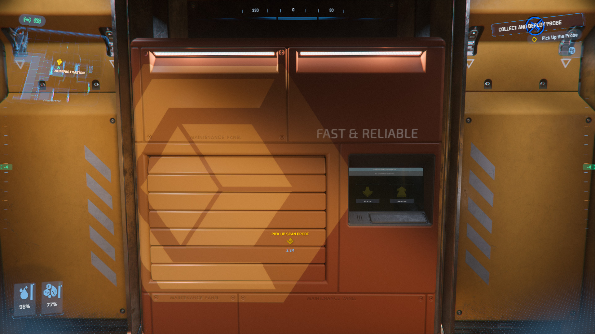{ width=600px }
    { width=300px }
    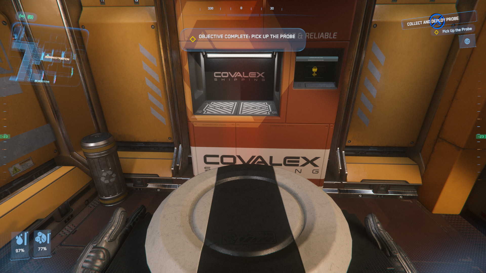{ width=300px }

1. Stow the probe on your ship.

    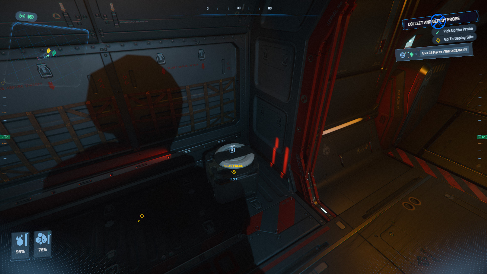{ width=600px }

    > ***Note:*** If you had to travel a long distance to the pick-up point
    > (e.g. an L3/L4/L5 station) you may have used a significant amount of your
    > ship's fuel. Remember to [refuel](../../ships/refuel-repair.md) before
    > leaving for the drop-off.

1. Travel to the drop-off location for the probe. There will be a marker in your
starmap (++f2++) for the location, which is typically in orbit of a planet or
moon nearby. If the route shows as obstructed, fly to the side of the station
nearest the drop-off and try again.

    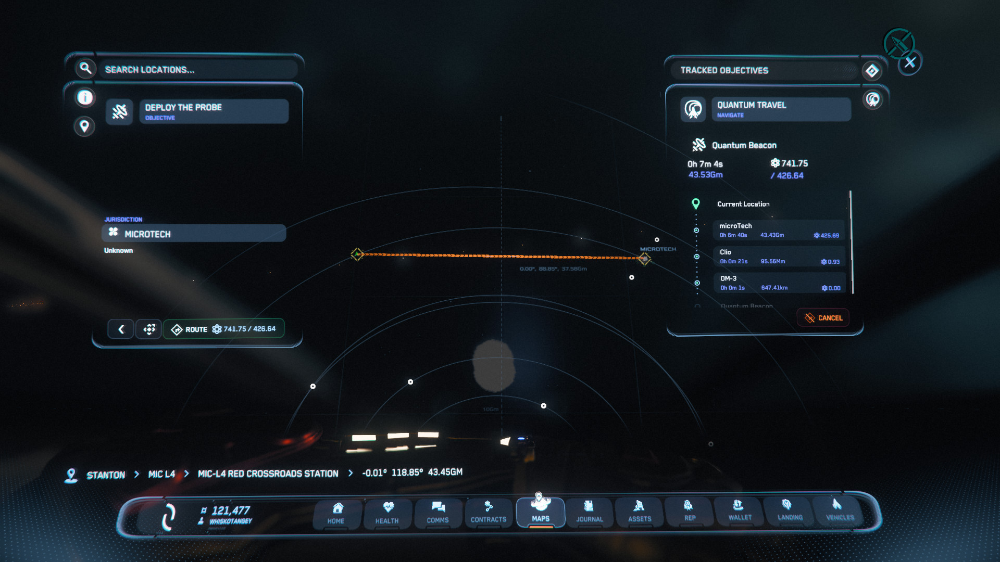{ width=300px }
    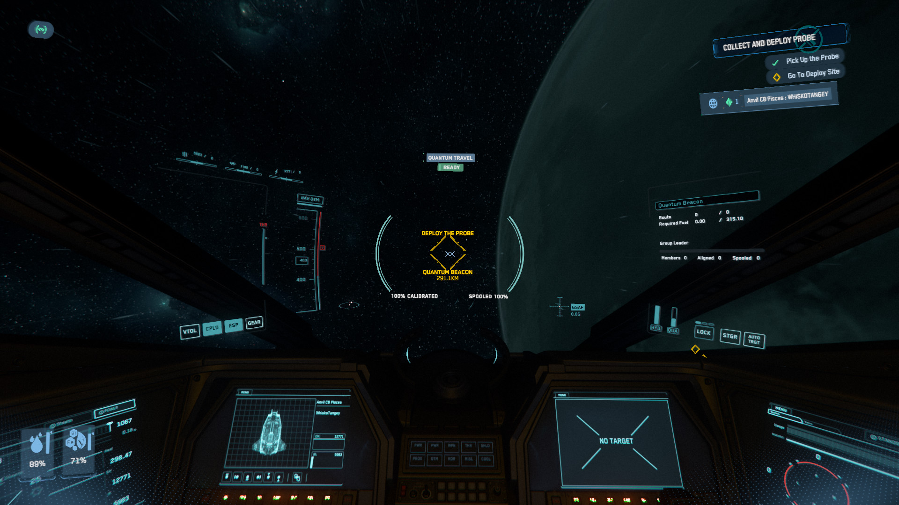{ width=300px }

1. Fly to within 200m of the drop-off marker.

    { width=600px }

1. Collect the probe and exit your ship into EVA. This is easiest if you use a
tractor beam, but you can carry the probe by hand as well.

    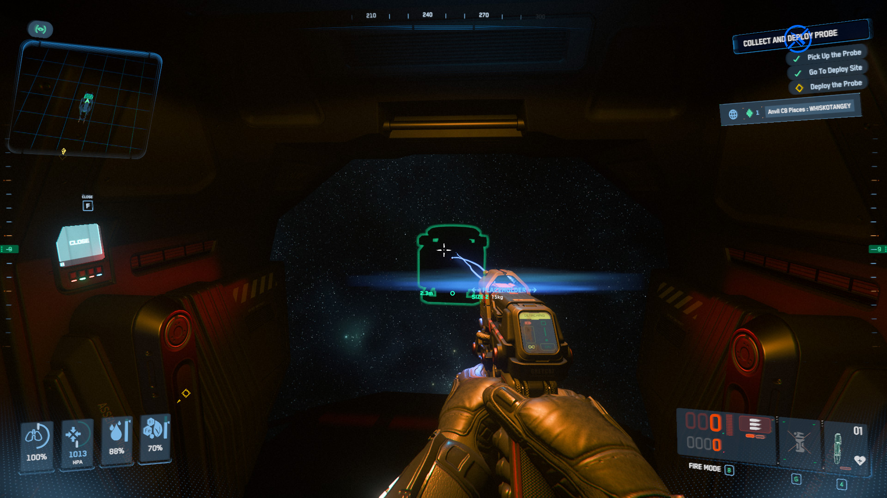{ width=300px }
    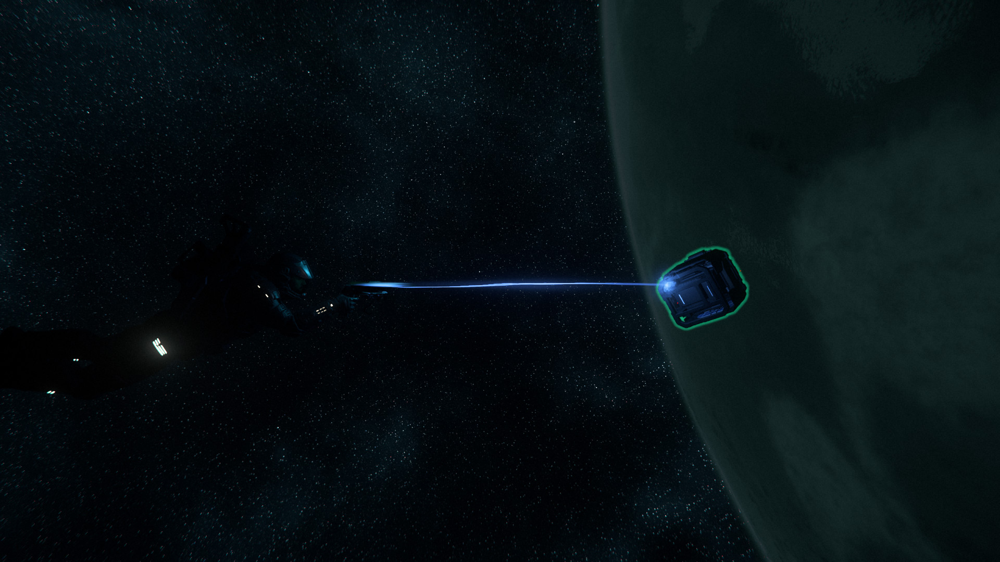{ width=300px }

1. Move close to the drop-off marker and release the probe.

    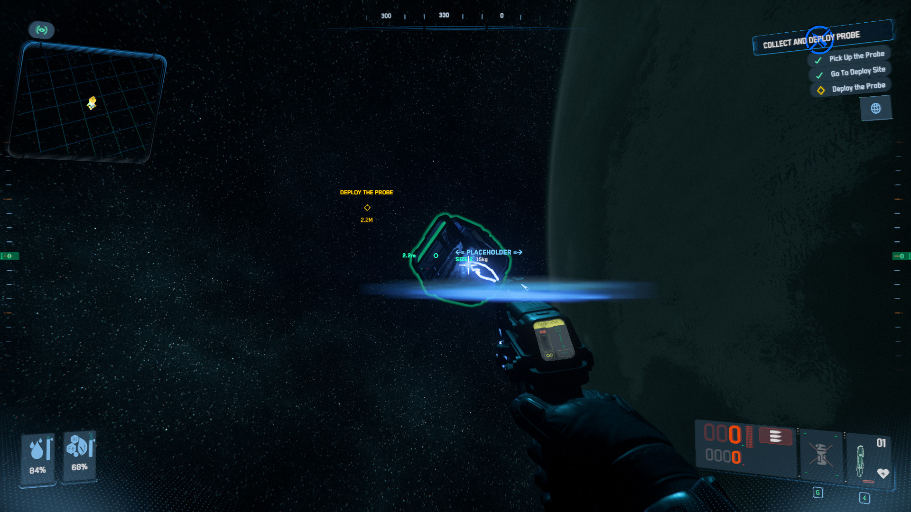{ width=600px }

1. Activate the probe by facing it, holding ++f++ and selecting Activate from
the menu.

    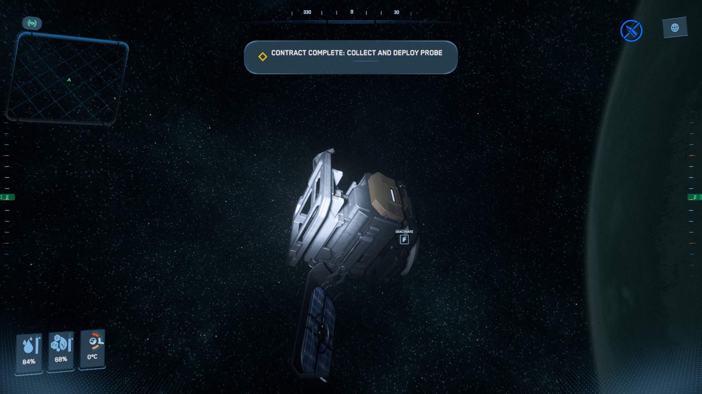{ width=600px }
