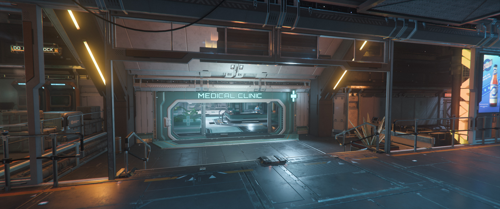
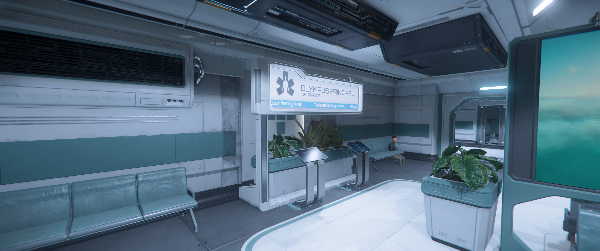
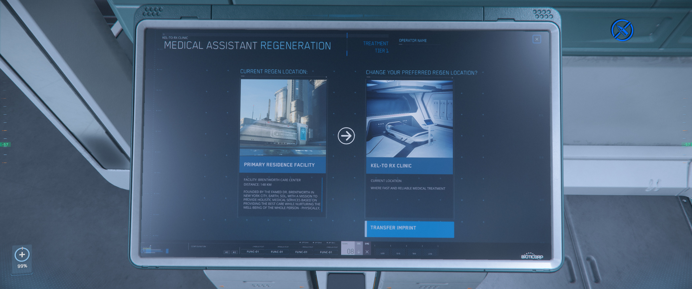
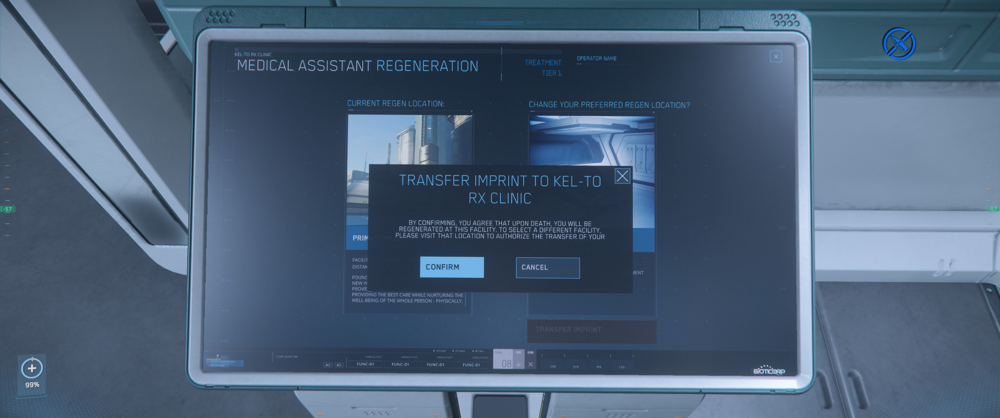
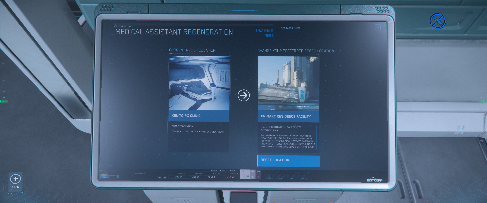

{{version_check("4.0")}}

## Info

All players in the Star Citizen alpha get free, unlimited respawns; any time
that your character dies, you will immediate respawn in your designated respawn
location.

By default, this will be the hospital of the Home City that you selected when
you first joined the Persistent Universe. However, you can move this respawn
point to any clinic or hospital in the 'verse, including at space stations, or
on ships or vehicles with medbeds.

!!! tip
    While cities have more facilities than orbital or lagrange stations, they
    are also more spread out and it can take 5-10 minutes from respawning to get
    to the spaceport and back into the game.

    If you transfer your respawn at an orbital station, the clinic will be in
    the same area as the hangars and you can get back into the game much more
    quickly.

## Transfer Respawn Imprint

1. Access Regeneration Terminal

    === "Clinics/Hospitals"

        - Travel to any location with a clinic or hospital, such as an LEO
        station, lagrange station, city or Grim Hex.

            { width=600 }

        - Find the Olympus Insurance terminals. These will be in different
        locations in different clinics, but are typically near the entrance in
        hospitals.

            { width=600 }

    === "Vehicle Medbeds"

        - Lie on the medbed, or access the medical terminal near the bed.

            { width=600 }

        - Select Regeneration.

1. The terminal will display the current regen location on the left, and an
option to transfer the player's imprint (respawn location). If the current
regen location is not the player's home city, there will also be an option to
reset it.

    { width=600 }

1. Select "Transfer Imprint" and Confirm.

    { width=300 }
    { width=300 }

!!! info "Vehicle Medbeds"

    Respawning at a vehicle medbed has two limitations over respawning at
    clinics and hospitals:

    1. The vehicle cannot be stored; it must be retrieved, in-game, and intact
    for a player to respawn in its medbed.

    1. Vehicle medbeds have a limited respawn range - 20km for Tier 3, and 50km
    for Tier 2.

    If either of these limitations is not met, the player with default back to
    respawning at their home city.

    It is also not currently possible to respawn in a vehicle that is in your
    [personal hangar]().
