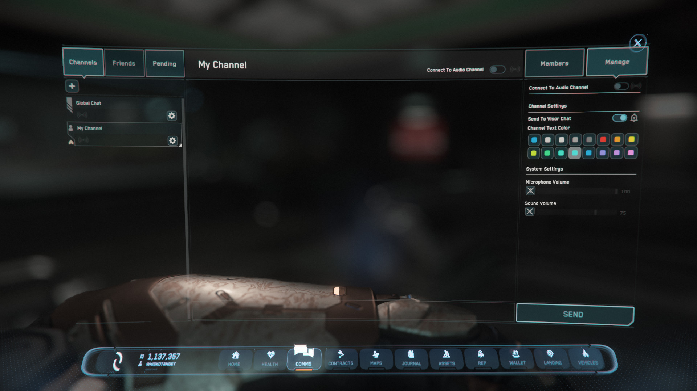

{{version_check("4.1")}}

## Info

Private chat channels are persistent, player-managed channels in the global chat
system. Players can use them to communicate within orgs and player groups
without needing to be in a party, or even on the same game shard.

Private channels will also last between sessions so you can create them once &
reuse them indefinitely.

## Create channel

1. Open the Comms app (++f11++), select Channels & click the plus icon in the
top left.

    { width=700 }

1. Enter a name for the new channel.

    {width=350}
    {width=350}

1. Add players to the channel by right-clicking their name in your Friends list,
or in the Members list of another channel, then selecting Add to Channel.

    {width=700}

1. You can send messages in the private channel by pressing ++enter++ in FPS
view then pressing ++tab++ until the private channel is selected
