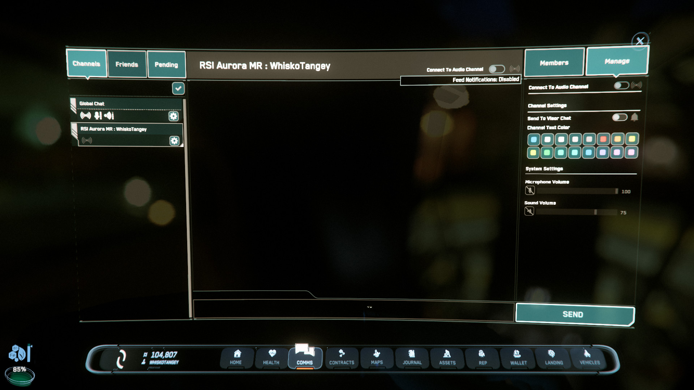

{{version_check("3.24.1")}}

## Hide Chat Entirely

Press ++f12++ to hide or show the chat window. You won't see any messages in any
channel, but you can still open the Comms app (++f11++) to send/receive messages.

## Hide Specific Channels

Open the Comms app (++f11++) & click the channel to hide. Select the Manage tab,
then click the `Send to Visor` toggle.

{width=300}
{width=300}

You can still access the channel from the Comms app, but it won't display and
can't be select on your HUD.
