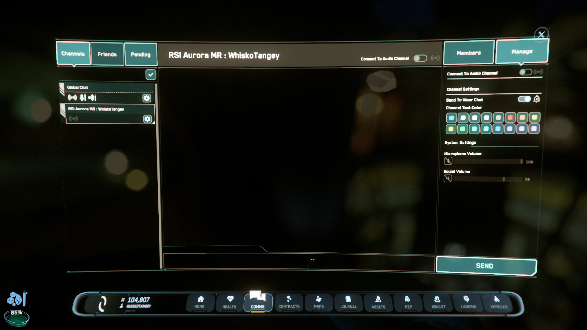

{{version_check("3.23.1")}}

## Info

While walking around game spaces like spaceports, cities and stations, you can
talk with other players, even if they are not in your party, by using Proximity
Comms - just hold ++"Numpad \+"++ and talk.

If, however, you want to mute other players, you can disconnect from global
Prox Comms and enjoy your game in (relative) silence.

## Mute Proximity Comms

1. Open the Comms app (++f11++) and select the Global Channel.

1. Click the `Connect to Audio Channel` toggle at the top of the app, or in the
Manage Channel tab.

{width=600}

!!! info
    There are also volume sliders in the Manage tab so you can reduce the volume
    of Proximity Comms instead.
