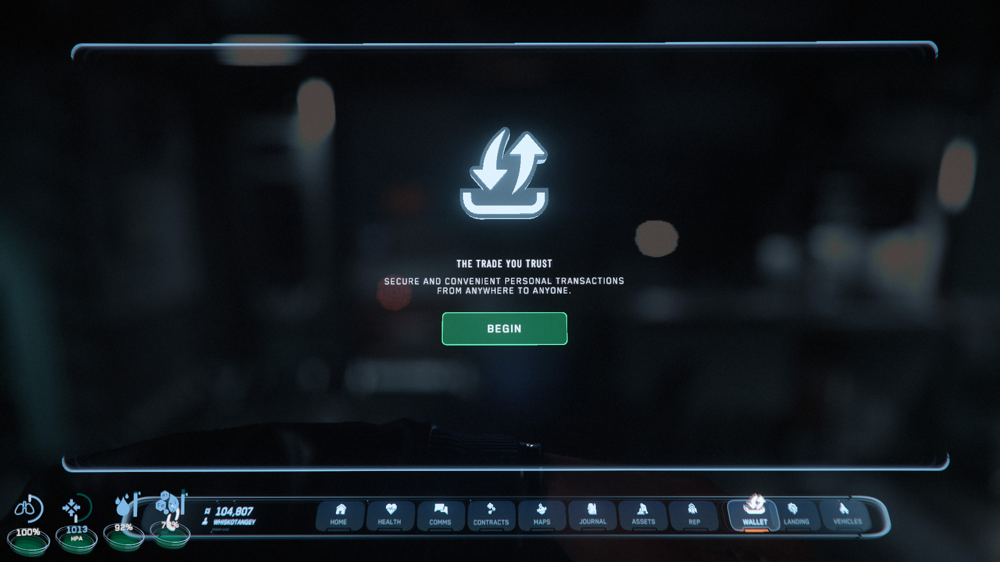
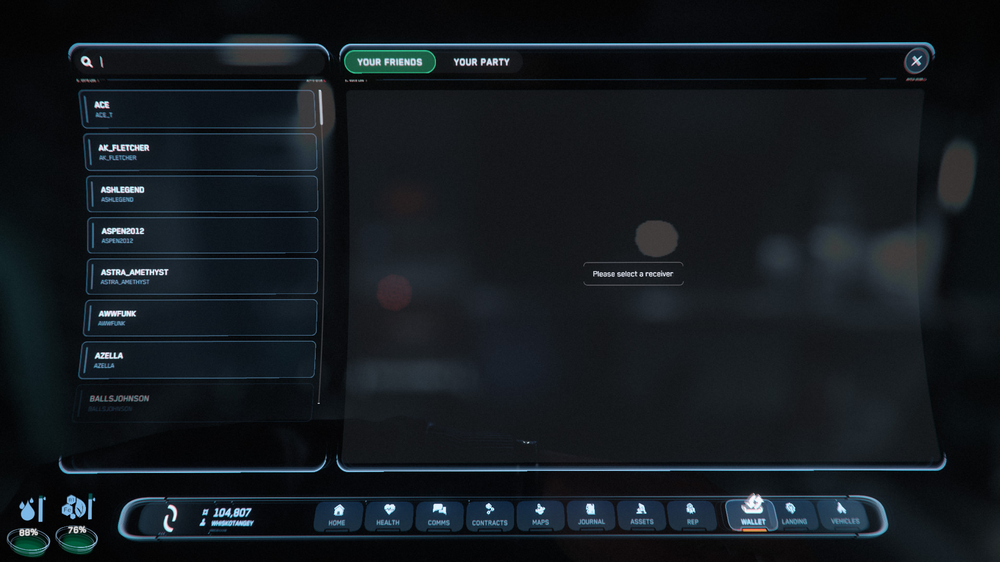
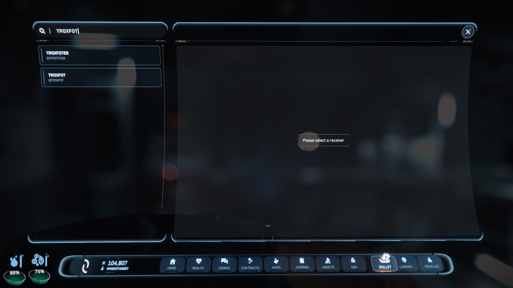
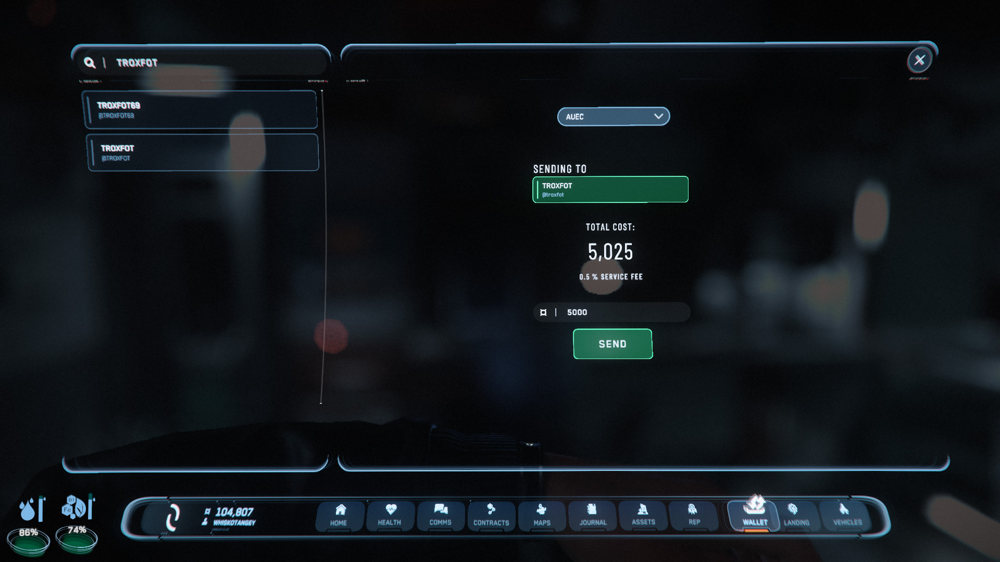
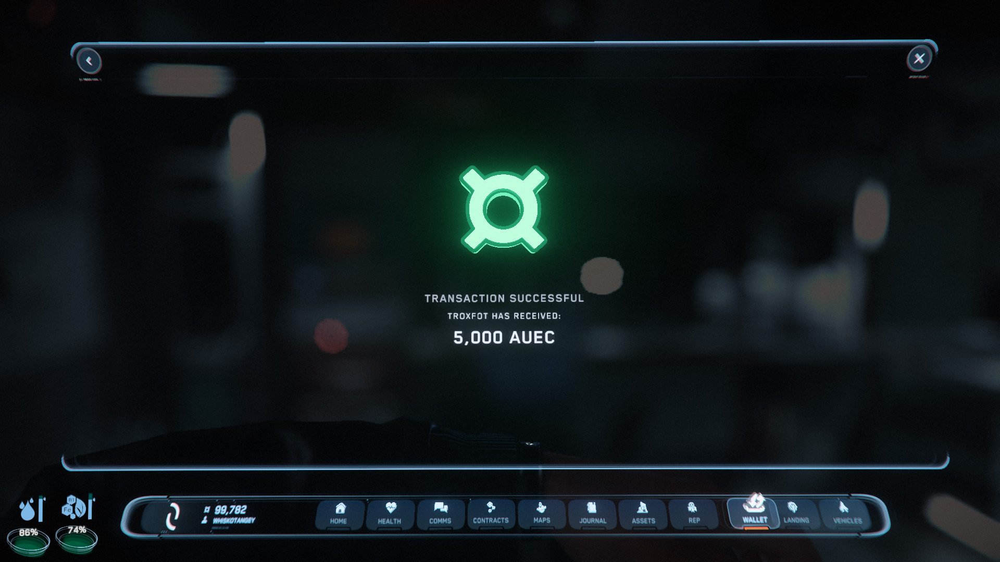

{{version_check("3.23.1")}}

## Info

When running industrial missions, trading with other players or hiring them for
rescues and transport, you may want to transfer aUEC directly. You can do this
all in your mobiGlass wallet app, though there is a 0.5% fee for transfers.

## Sending Money

1. Open your mobiGlass (++f1++) and select the Wallet app.

{width=600}

1. Choose a recipient - either select from your list of friends, select from
players in your party, or search for a player name in the top left.

{width=300}
{width=300}

1. Enter an amount; this is the total that the other player will receive. You
will pay this amount, plus the 0.5% fee.

{width=600}

1. Click Send and the aUEC will transfer.

{width=600}
