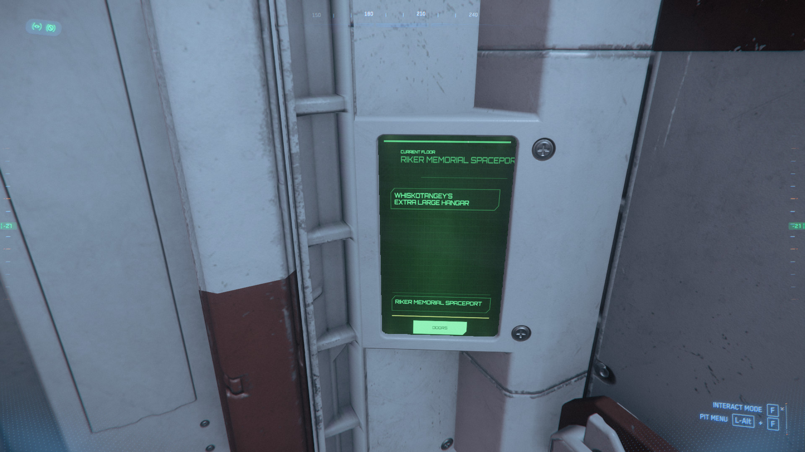

{{version_check("4.0")}}

## Info

Every player in the Star Citizen Persistent Universe gets a Personal Hangar at
their home city. This hangar is **persistent**, which means that if you leave
ships, vehicles, furniture, cargo, equipment or any other physical items in the
hangar, they will be persisted after you leave (or log off) and still be there
when you come back.

All other hangars are Public hangars (even at your Home City) which are not
persisted, and items left in non-peristent hangars may despawn when you leave.

??? info "Personal Hangar Size"
    Your Personal Hangar is created when you first log into the Persistent
    Universe after a patch release, and the size of the hangar is set by the
    size of your largest available ship at that time. This will not change until
    the next patch release, even if you purchase a larger ship.
    
    If you ever need to retrieve a larger ship than your Personal Hangar can fit
    you can call it from the public ASOP terminals, and you'll be provided a
    Public hangar.

## Accessing your Personal Hangar

1. Travel to the Spaceport for your Home City.

1. Head to the ASOP/Hangars lobby for the spaceport (you don't need access the ASOP
terminals).

1. Head directly to the Hangar Elevators, call an elevator and check the
elevator destination panel.

    {width=700}

    You should see an option for your Personal Hangar on the list.

    > ***Note:*** If the spaceport has Docking Ports or Pads, they may be listed
    before your Personal Hangar and you'll need to scroll down the list with
    ++"Scroll Wheel"++.

1. Select your hangar in the destination list.

    > ***Note:*** If the option for your hangar isn't showing, it may be taking
    a moment to stream in; you can exit the elevator, call another then check
    again - or call a ship from the ASOP terminals to force your Hangar to
    stream in.