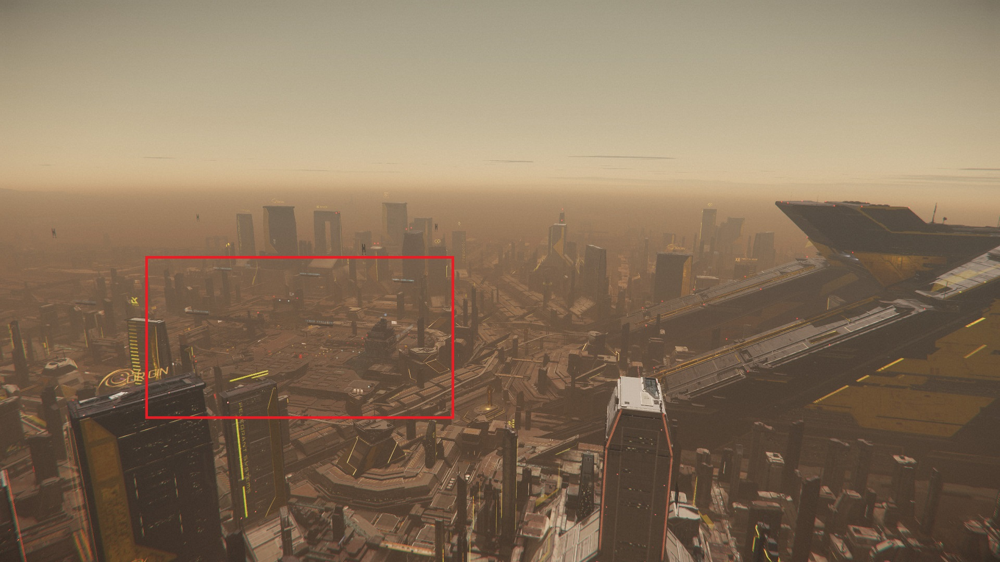

{{version_check("3.24.2")}}

## Info

For each city there is a main spaceport that is typically a short distance away
from the main city quantum marker. There is no direct marker for the spaceport
location, but there are landmarks that can help you find them easily.

## New Babbage, Microtech

The quantum marker for Microtech is placed on the Aspire residences where
players spawn in.

New Babbage Interplanetary Spaceport is on the mountainside south of the marker,
across the open ice lake, and is easily located by following the train lines.

{width=350}
{width=350}

## Lorville, Hurston

Teasa Spaceport is right at the centre of the city, in front of the Hurston
tower, and can be identified by the floating blue text directly above it.

{width=350}
{width=350}

## Orison, Crusader

August Dunlow Spaceport has a distinctive, spider-like shape when viewed from
above.

{width=350}

## Area 18, ArcCorp

Riker Memorial Spaceport is often difficult to see on approach because of the
thick cloud layers above the city; it can be recognised easily when visible by
the large, flat, red/white surface. To reach it, start at the Area 18 marker
above the I/O Tower on ArcCorp Plaza, then fly directly west, following the neon
billboards along the highway.

{width=350}
