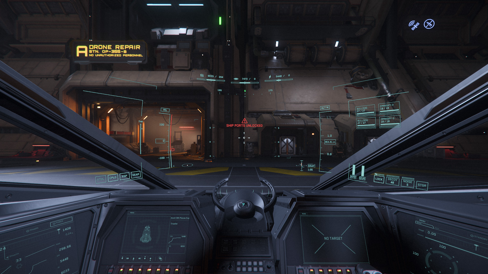
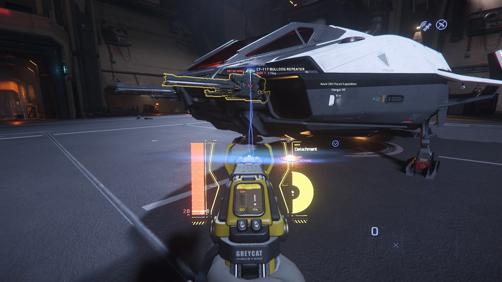

{{version_check("3.24.1")}}

## Info

Various components - weapons, missiles, ship systems, mining heads and others -
can be removed from ships in-game using a tractor beam tool, and then sold for
profit or transfered to your own ships as a replacement or upgrade.

This includes ships that you destroy as part of Bounties or other missions!

## Removing Components

!!! warning "Accessible Components"

    Not all components can be removed with the tractor beam; e.g. Size 3
    components are too large, and missile racks are fixed in place, though the
    individual missiles are detachable.

    Additionally, ship designs that have been in the game for a longer time may
    not have their internal components made accessible yet.

1. You will need a
[ship or shipwreck](../../careers/industrial/salvage/find-ships.md) to remove the
components from, and a [tractor beam](../../fps/equipment/tractor-beam.md). If
possible, move the ship to a safe location where you can use a tractor beam.

    > ***Note:*** You typically can't use tractor beams in an armistice area,
    but this restriction is lifted in hangars and on landing pads.

2. If the ship is functional and not in a soft-death state:
    - Sit in the pilot seat.
    - Unlock all ports (++ralt+k++). If you are removing a vital component (e.g.
    a cooler or power plant) be sure to power off (++u++) the ship to avoid
    damage.

    {width=600}

3. Find the component or weapon on the ship, equip your tractor beam (++5++) and
switch it to Detaching/Detachment (++b++).

    {width=600}

4. Detach the component with the tractor beam:
    - Point the tool at the component & enable the beam (++"LMB"++).
    - Drag the component with the mouse in the direction indicated by the arrow
    until it comes loose. The scroll wheel can be used to pull or push a
    component.

    {width=300}
    {width=300}

5. The component is now detached and can be physically stowed in your ship to
sell, or attached to an empty slot on another ship.

??? tip "Where to sell"

    Components can be sold at any stores where you'd typically buy them; e.g.
    ship weapons at Ship Weapon Stores or Centermass, power plants at Platinum
    Bay, etc.

    You'll also get a better sale price when selling to [a store that stocks that
    specific component](./buying-components.md).
