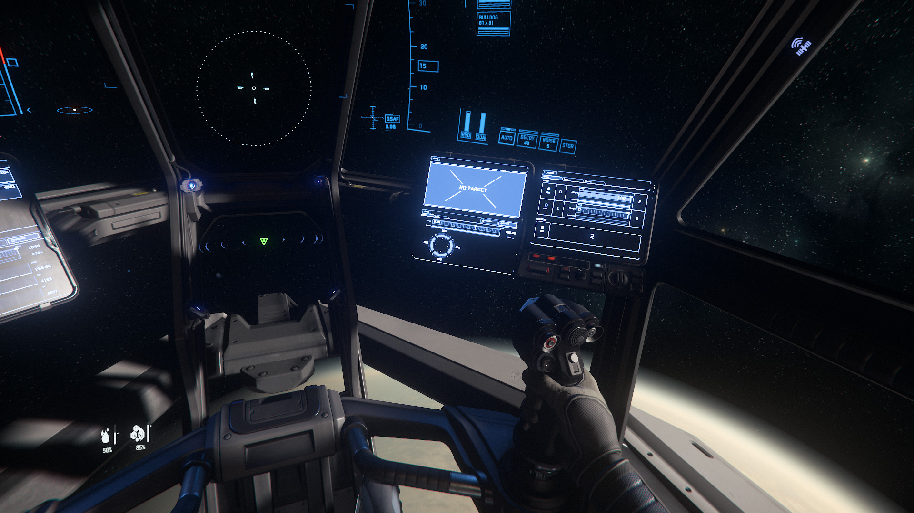
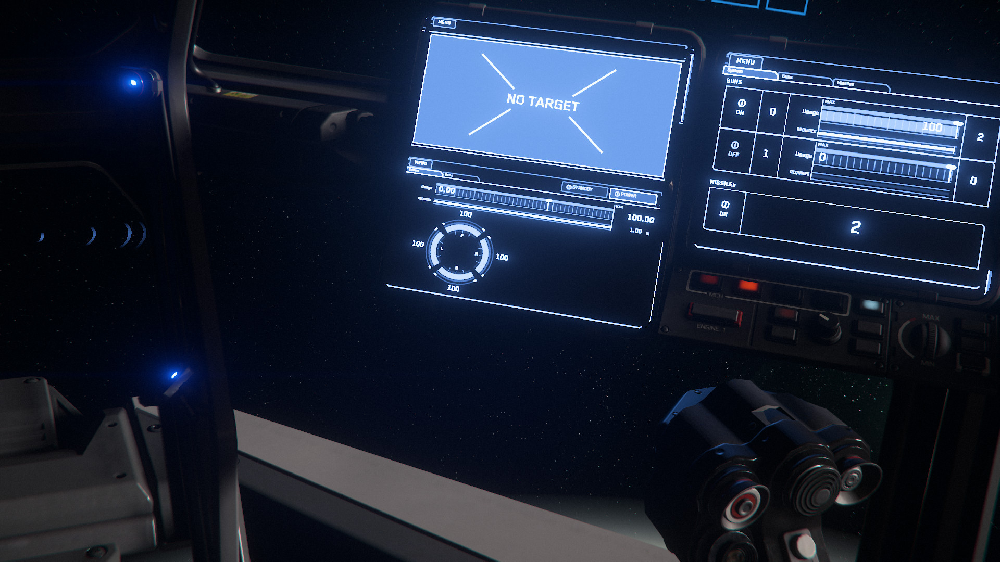
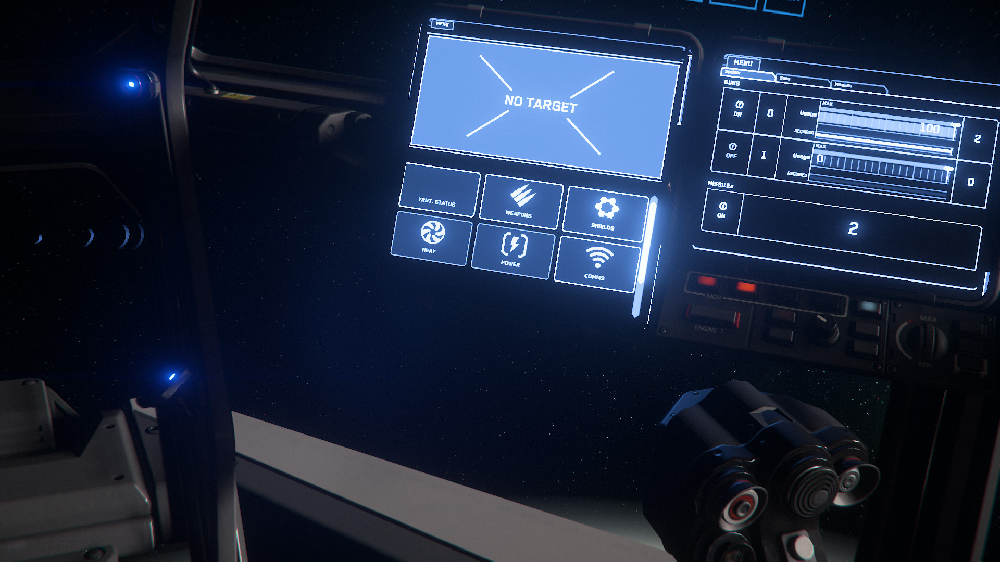
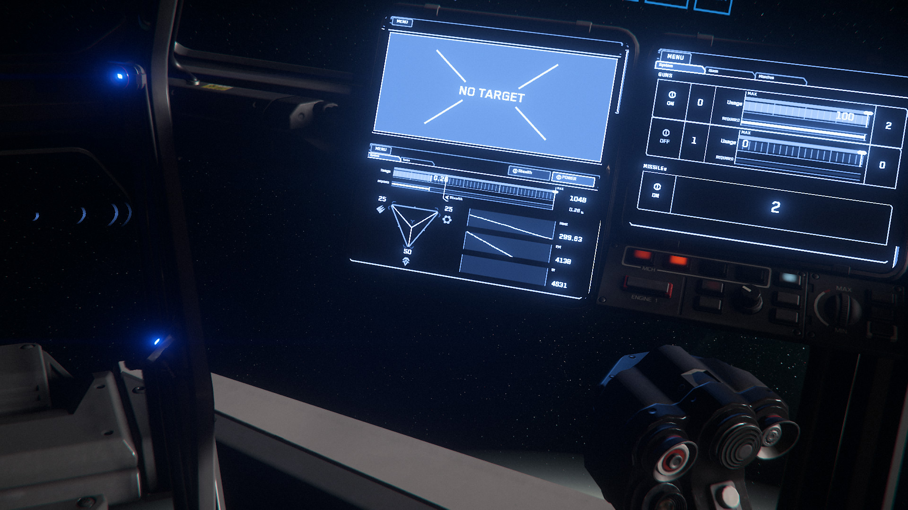
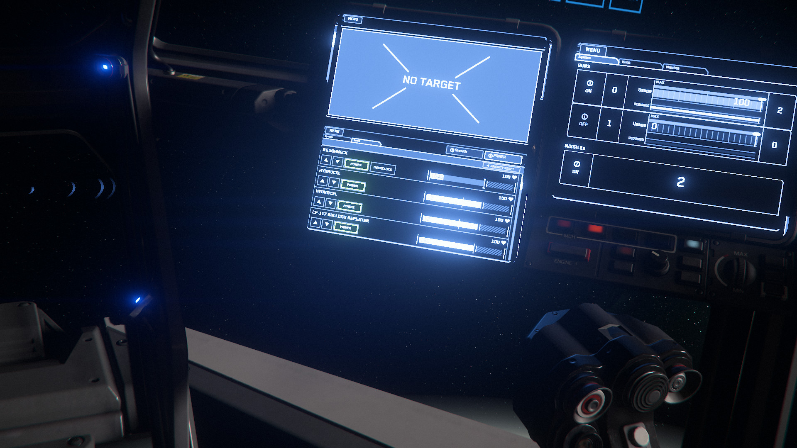

{{version_check("3.23.0")}}

## Info

Ships & ground vehicles include one or more MFDs (Multi-Function Displays)
attached to their flight seats, which are customisable displays that provide
data readouts and control over various ship systems. While there is a default
configuration for each ship, players can change the screen displayed on each MFD
to access more functionality, or simply customise their flight experience.

## Changing MFDs

1. Make sure the ship is powered up (++ralt+r++ while sitting in the pilot
seat), then sit in any flight seat, crew station or manual turret with MFDs.

    > ***Note:*** If the seat is not the main pilot seat, you may have to power
    it on separately - hold ++f++ and look around the controls for a Power On
    option.

2. When the MFDs are showing, hold F and move the mouse till you are facing the
MFD you want to change.

    {width=600}

3. Zoom in on the screen (++"MMB"++).

    {width=600}

4. Click the Menu button in the top left of the MFD.

    {width=600}

5. Click the screen that you want to display. You may need to scroll
(++"Scroll Wheel"++) to see all available options.

6. The selected screen is now visible and interactable on the MFD.

    {width=600}

??? tip "MFD with Multiple Tabs"

    Some screens will have multiple tabs to show more detailed information; for
    example, the Weapons screen includes Guns & Missile tabs with additional
    controls for those weapon types, while Power has a list of all powered items
    (down to the individual thrusters). Simply click the tabs directly under the
    Menu button to switch between them.

    {width=600}
