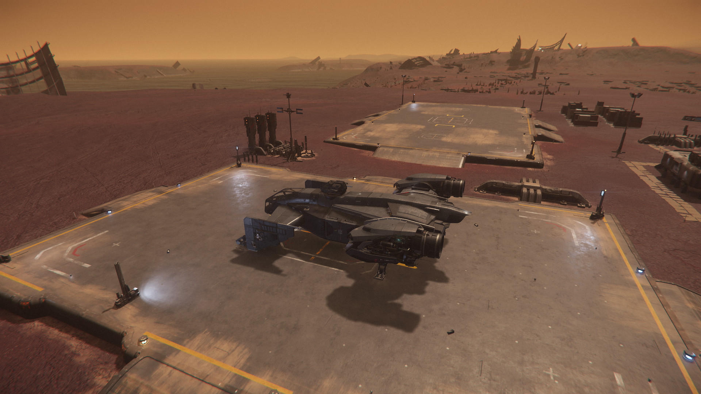
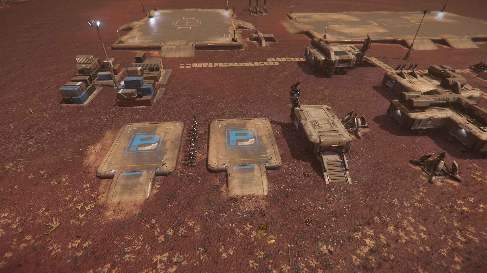
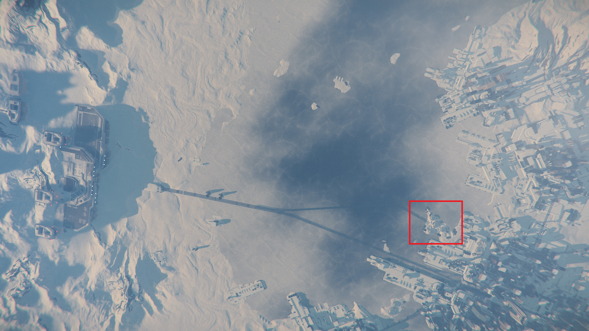
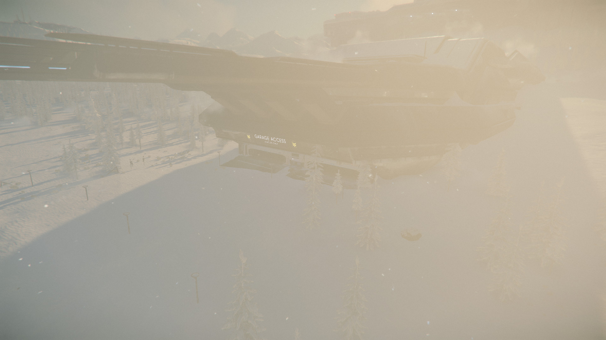
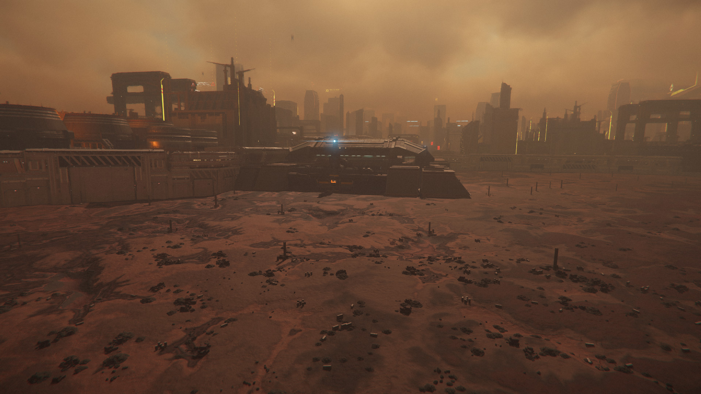
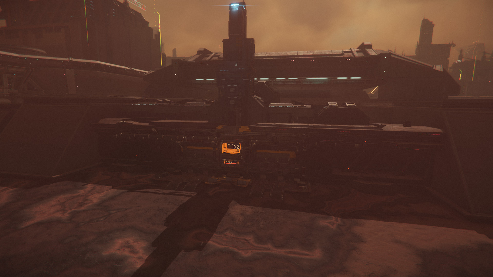
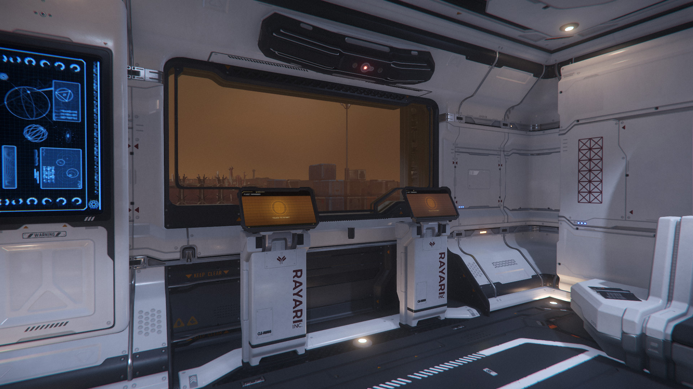
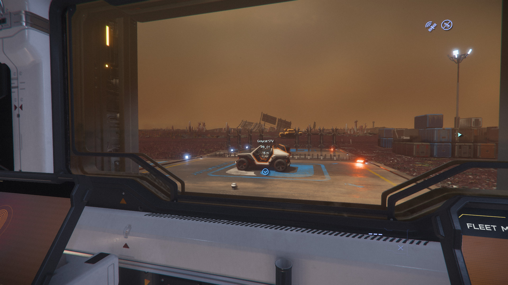
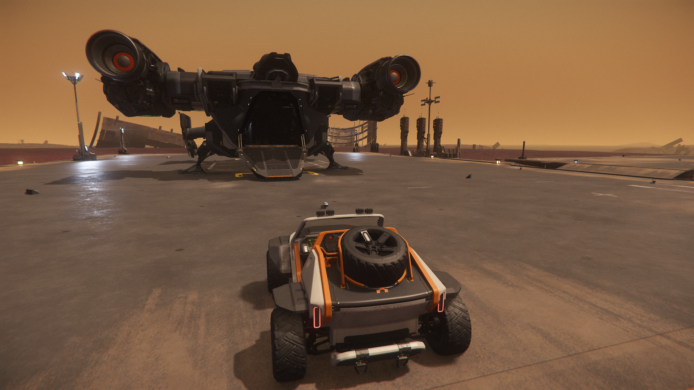
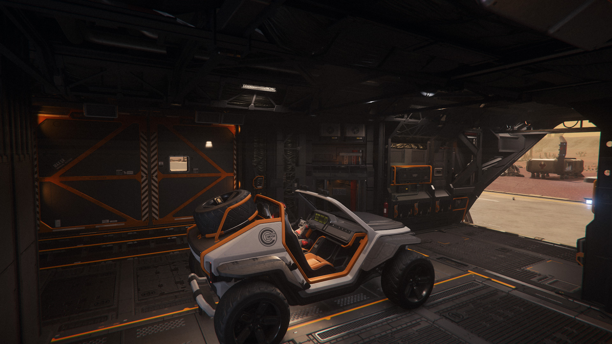

# How do I load ground vehicles onto my ship?

!!! success inline end "Last Updated"
    Alpha 3.22.1

## Info

Many ships have cargo holds large enough to hold ground vehicles and even
smaller spacecraft; some, like the Starlifter series, are purpose-built to
carry & deliver ground vehicles.

However, the hangars designed for retrieving ships are in different locations
than the garages or pad for ground vehicles. Some cities have dedicated
facilities for storing and retrieving ground vehicles, while Platinum Bay
operate a series of vehicle pads at ground stations around the system.

!!! info "Changes coming in 3.23"

    The Personal Hangars that are coming in 3.23 will make the process of
    calling & loading vehicles much easier, as you will be able to retrieve the
    ground vehicle, then retrieve the carrier into the same hangar. This guide
    explains the process as of patch 3.22.

You'll need to own or rent a ground vehicle, and own or rent a ship large
enough to carry it. You can check the
[Ground Vehicle grid](https://starcitizen.tools/Ground_vehicles) on the SC Wiki
to see what can will fit. As a starter, you can rent a Cutlass Black fairly
cheaply from refinery decks, and also the Greycat ROC mining buggy from the
same location - or pick up a Greycat STV from Astro Armada in Area 18, which is
a cheap, small but versatile two-seater buggy.

## Load from ground garages

1. Retrieve your ship and fly it to a location with ground garages or Platinum
Bay pads:

    - New Babbage; NBIS Garage or Commons Surface Entrance

    - Lorville Perimeter Gates

    - Ground stations; e.g. HDMS locations, Rayari Research outposts, ArcCorp
    Mining areas or Shubin Mining facilities

        > ***Note:*** Ground stations can be found on planets and moons,
        alongside other locations with similar names.
        > For example, HDMS locations are mining stations with refueling and
        Platinum Bay pads, while HDSF locations are secured underground bunkers
        that will likely attack you if you get too close.
        > Similarly, mining and research stations are generally friendly, while
        processing facilities are hostile.

        ??? tip "Loading snubs & shuttles"

            Platinum Bay pads can also be used to retrieve XXS ships, such as
            snub fighters and shuttles, and they will often fit inside the same
            cargo spaces as medium-to-large ground vehicles.

1. Land your ship and access the terminal area

    === "Ground Stations"

        - Land your ship near the Platinum Bay pads; you can land on the open
        ground, though landing on a dedicated ship pad will give you a flat
        surface and enable you to use a tractor beam.

            {width=450}

        - Exit your ship and walk to the Platinum Bay building, which is marked
        with blue lights on a large antenna/spire.

            {width=450}

            !!! warning "Don't block the pads in your ship"

                If you hover your ship too close to the small PB pads or try
                and land directly on them, your ship will be impounded, causing
                it to be stored at the station. This can be a serious problem
                as there are no pads available that are large enough to
                retrieve the ship, so you would have to get back to a space
                station or spaceport to get it back.

    === "New Babbage"

        - There are two locations to retrieve ground vehicles in New Babbage:
        the spaceport garages and the Commons surface entrance.

            - The **Commons Surface Entrance** can be found on the edge of the
            city facing the ice lake and the space port; follow the train lines
            from the spaceport towards the city and follow the left branch when
            it splits. The Commons itself is a group of four domes clustered
            together.

                {width=300}
                {width=300}

                There are several options for landing near the Commons garage -
                you can land on the ice lake for a flat surface, or directly on
                the snowy slope heading up to the garage; there's also a medium
                landing pad on the other side of the domes that can be useful
                for larger ships, but isn't the easiest to drive vehicles to.

            - The entrance to the **NBIS Garages** is hidden under where the
            train lines to the spaceport enter the mountain.

                {width=300}
                {width=300}

    === "Lorville"

        - There are six gates around the perimeter wall of Lorville. They
        aren't especially easy to find, especially as some are tucked into
        corners, but if you fly around the wall you'll eventually find one.

            {width=300}
            {width=300}

1. Once inside the terminal area, retrieve your vehicle from the terminal.

    {width=300}
    {width=300}

    > ***Note:*** At most locations you can simply walk to the vehicle once it
    is retrieved; at the NBIS Garages, you will need to take an elevator to the
    specific garage number that you are given by the terminal. Both NB Commons
    and NBIS require you to [contact ATC](./exit-hangar.md) before allowing you
    to leave.

1. You can drive the vehicle directly onto your ship if it has a ramp or
elevator.

    {width=300}
    {width=300}

    Vehicles are often light enough to load with a handheld
    [tractor beam](../fps/equipment/tractor-beam.md) which may be necessary for
    ships that don't have ramps, like the Caterpillar. You can also use
    vehicle-mounted tractor beams for heavier vehicles, or when in armistice
    but not landed on a pad.

!!! tip "Storing ships with vehicles"

    If you store a ship with a vehicle loaded, the vehicle will still be there
    when you next retrieve it. This allows you to gear up a ship ahead of time
    with equipment and vehicles, then store it ready for when you want to run
    missions.
