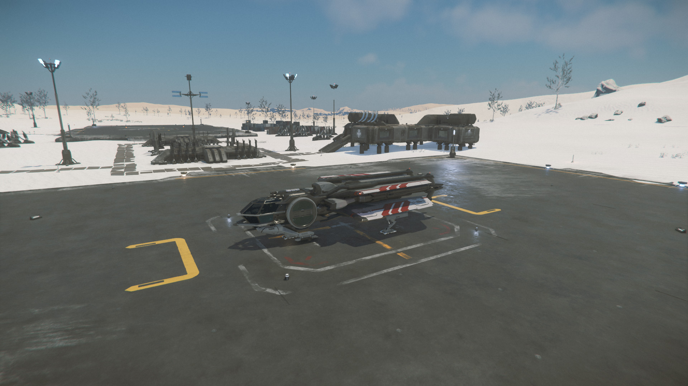
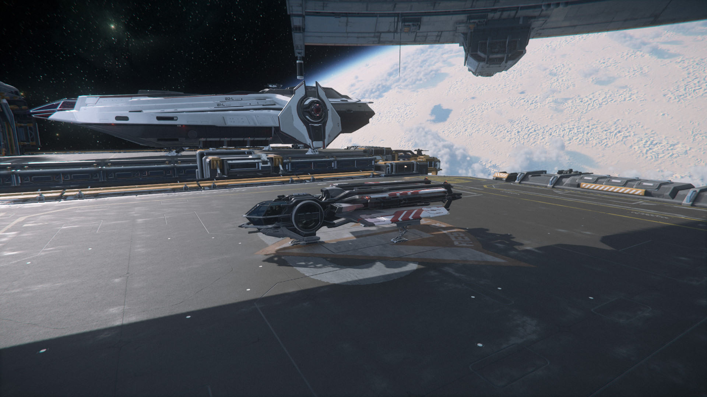
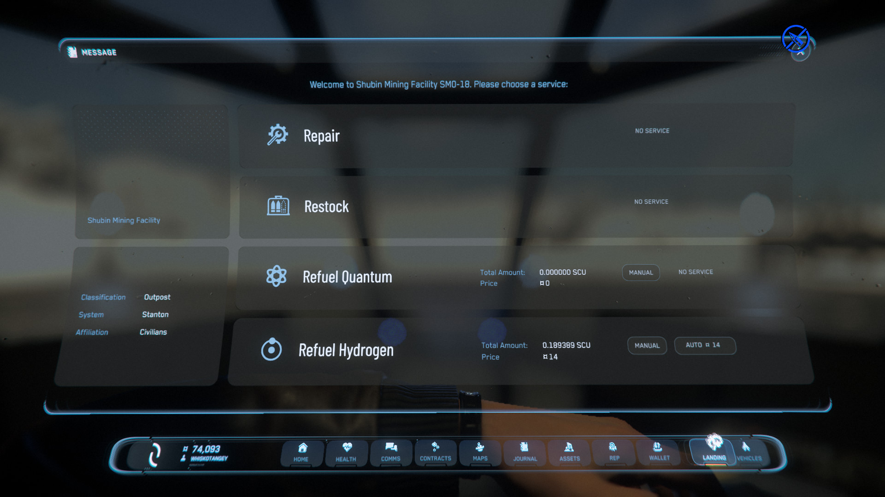
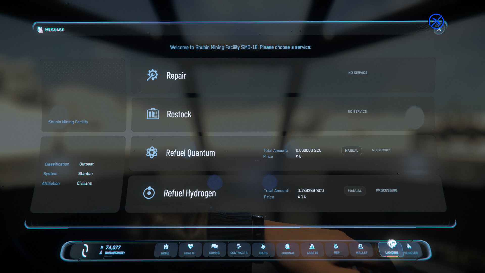
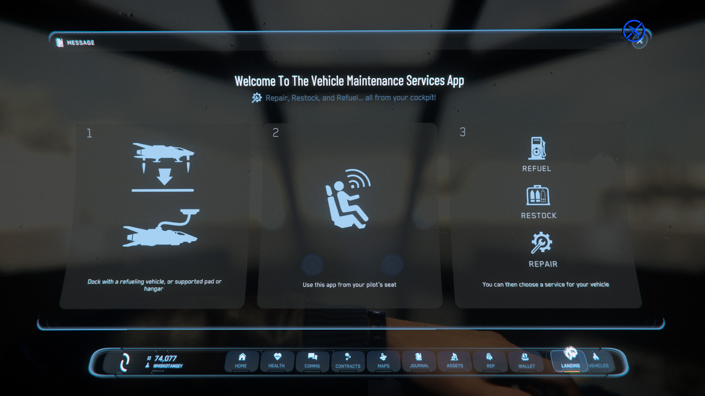

{{version_check("3.23.1")}}

## Info

Your ship hold different resources that can be used up over time - Quantanium
for FTL travel, Hydrogen fuel for sub-light & ballastic ammo/missiles for
combat. You can restock/refuel these resources at many locations around the
'verse, as well as repair most damage to your ship, including worn-out
components and lost parts.

!!! warning "Repairing missing weapons, wings or hull sections"

    If your ship has taken significant damage to the point that parts of the
    hull or weapon systems are missing, it is strongly recommended to abandon
    the ship and claim a replacement. While repairing the ship _should_ replace
    the missing parts, that process is not 100% reliable in current builds and
    it's possible for the damage to become permanent, especially if the ship is
    stored.

## At a hangar or pad

1. Park your vehicle at a hangar, landing pad or docking port. The open pads
outside space stations that are not controlled by ATC, as well as pads at
ground stations (like mining or research stations) can also be used.

    {width=300}
    {width=300}

2. Sit in the pilot seat, open your Mobiglass (++f1++) and select the Landing tab.

    {width=600}

    > ***Note:*** If you see a guide to using Vehicle Maintenance instead of
    the action buttons, you may not be in the correct location. Either find a
    suitable hangar or pad, or check
    <!-- markdownlint-disable-next-line MD051 -->
    [Issues with Vehicle Maintenance](#issues) below.

3. Select any of Repair, Restock, Refuel Quantum or Refuel Hydrogen as needed.
The price will be listed alongside the button and will increase depending on
the amount of fuel consumed, damage taken etc. When no restock is required the
button is marked "No Service Required".

    - Repair will restore any lost hull health or external damage, repair
    damaged or worn components, and attempt to replace missing components or
    ship parts.

    - Restock will replace used ammunition for ballistic weapons, expended
    missiles and flares/decoys.

    - Refuel will completely fill tanks of the relevant fuel type. You can
    select manual if you only want to partially refuel.

4. The option will display "Processing", and a warning will display on the HUD
while the repair, refuel or restock action is taking place. This will take some
time depending on the amount of damage, fuel, etc. Taking off before the action
is complete will cancel it.

    {width=600}

5. Once the HUD warnings disappear, the refuel/repair/restock is complete and
you can safely take off. You can verify by checking the Vehicle Maintenance tab
again, and the relevant buttons should be marked "No Service Required".

<!-- markdownlint-disable-next-line MD042 -->
{ #issues }
!!! info "Issues with Vehicle Maintenance"

    {width=300 align=right}

    If you open the Vehicle Maintenance tab and the buttons do not appear,
    there can be a couple of causes:

    - You may not be fully on the pad, or centered enough; you can hover over
    the pad and autoland (hold ++n++) to correctly position.
    - There may be another vehicle blocking use of the pad - make sure no other
    ships are on the same pad.
    - If the server is over-loaded, it may not detect when you land on the pad.
    Trying moving to another - the open pads at stations are helpful for this.
