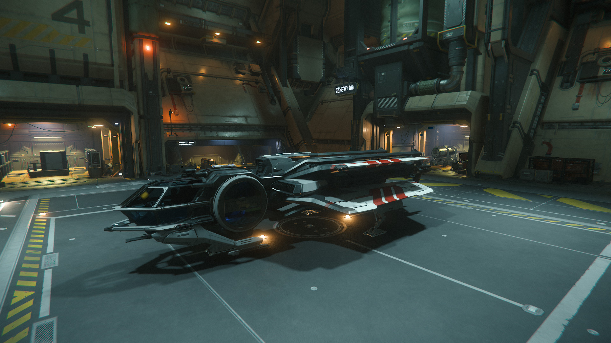
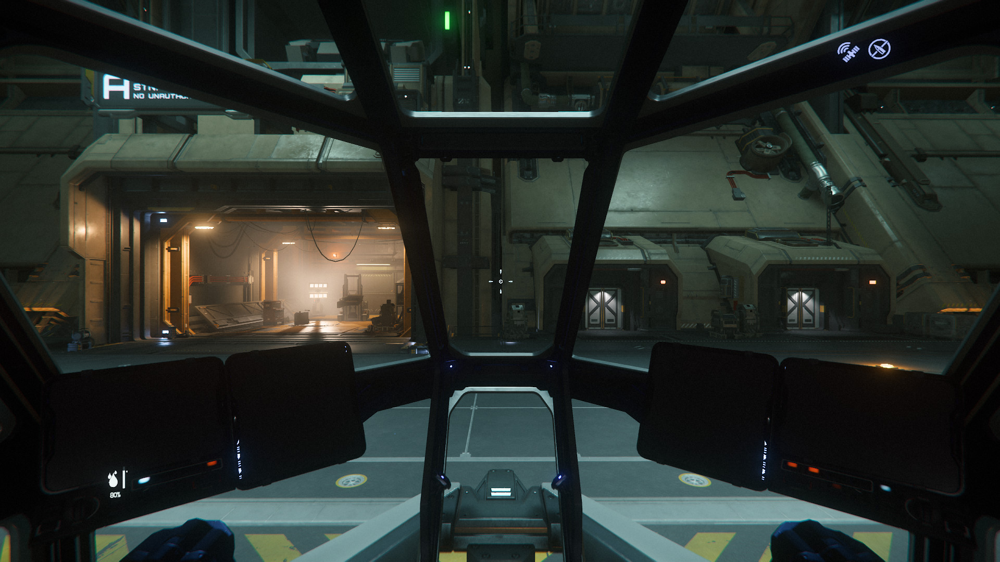
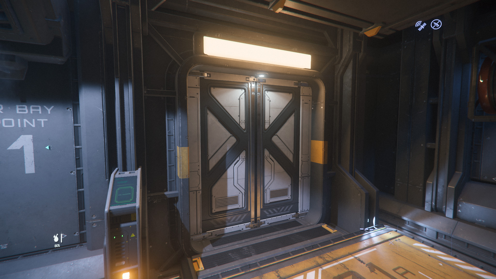
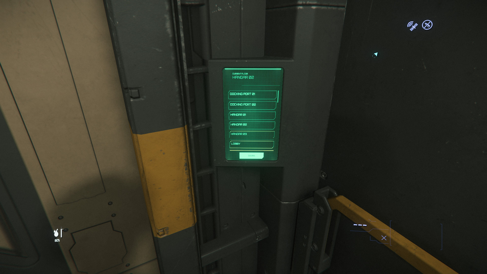
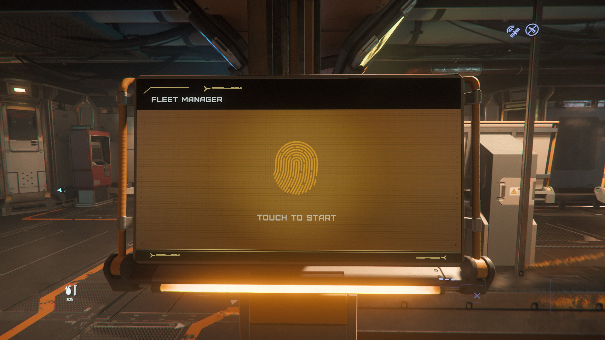
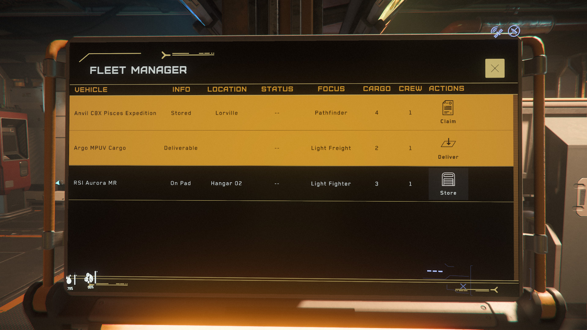
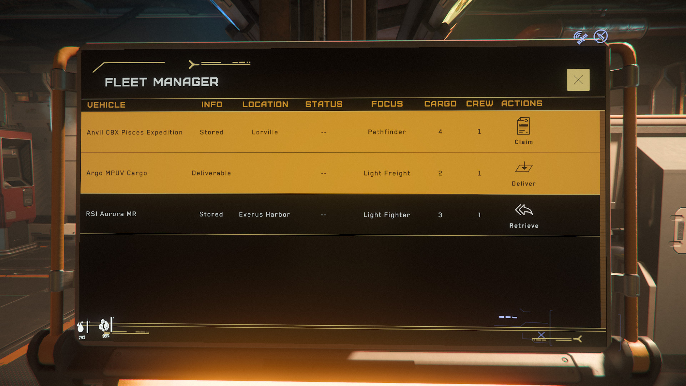

{{version_check("4.1")}}

## Info

Ships and vehicles can be stored at any location that has ASOP terminals and
large enough hangars or pads to accomodate them.

Storing a ship persists the entire ship (including inventory, vehicles stowed
onboard and any physical items) safely until the next time you retrieve it; you
should always store your ship before logging off.

Storing your ship also allows you to modify it through the MobiGlass to apply
paints or new upgrades.

!!! warning Docking Sub-Capitals
    Some ships (e.g. Hammerhead, 890 Jump) are large enough that they need to
    dock at most stations. Large ships that do not support docking (e.g.
    Reclaimer) cannot land at most stations and must be stored at city
    spaceports or Grim Hex.

## Storing at a spaceport or space station

1. Park your vehicle at a hangar, landing pad or docking port that has been
issued to you by [ATC](./landing-atc.md).

    {width=600}

    > ***Note:*** All space stations have 4 open landing pads that do not
    require permission from ATC to land at; these cannot be used for storing
    your ship and are intended for making repairs, refuelling and quick
    passenger pickups.

1. Make sure that your ship is fully powered down (++u++).

    {width=600}

1. Either find an ASOP terminal in your hangar, or take the elevator back to the
lobby and use a terminal there.

    {width=300}
    {width=300}
    {width=600}

1. If parked in the correct location, the terminal will show the name and a
Store option.

    {width=600}

1. Click Store and wait until the screen shows Stored.

    {width=600}
